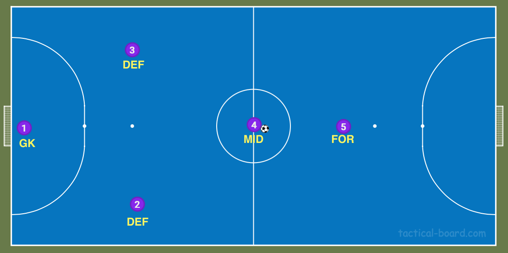
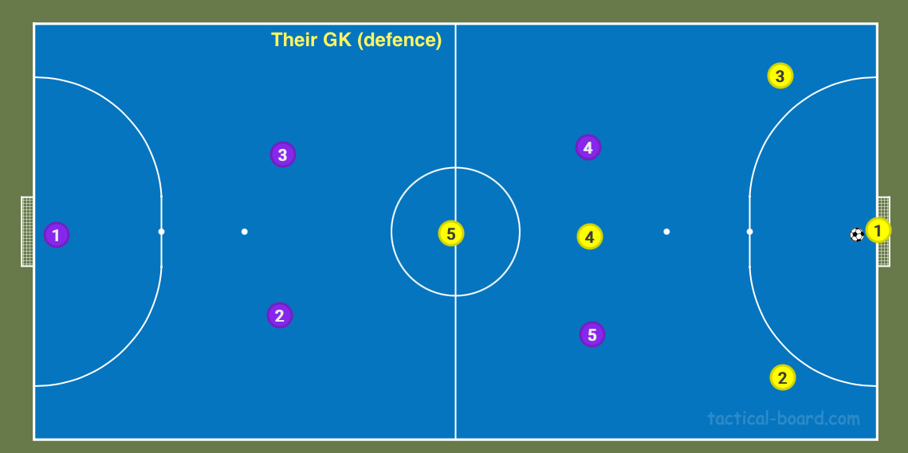
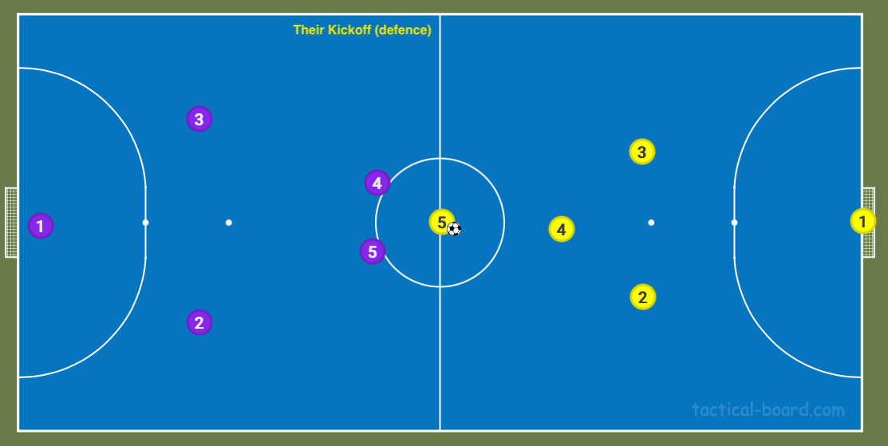
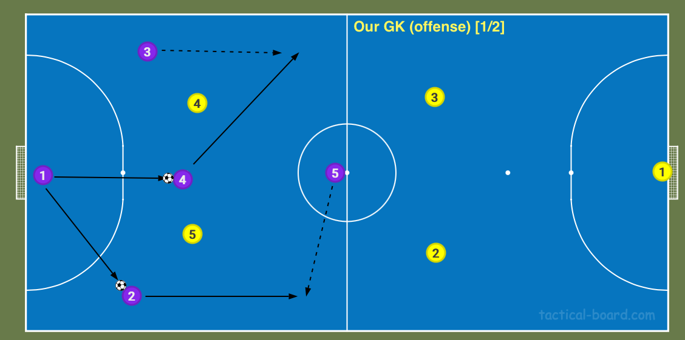
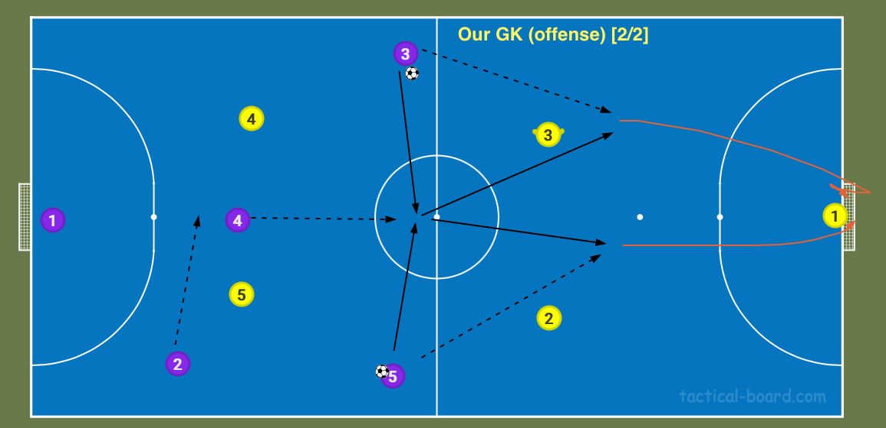
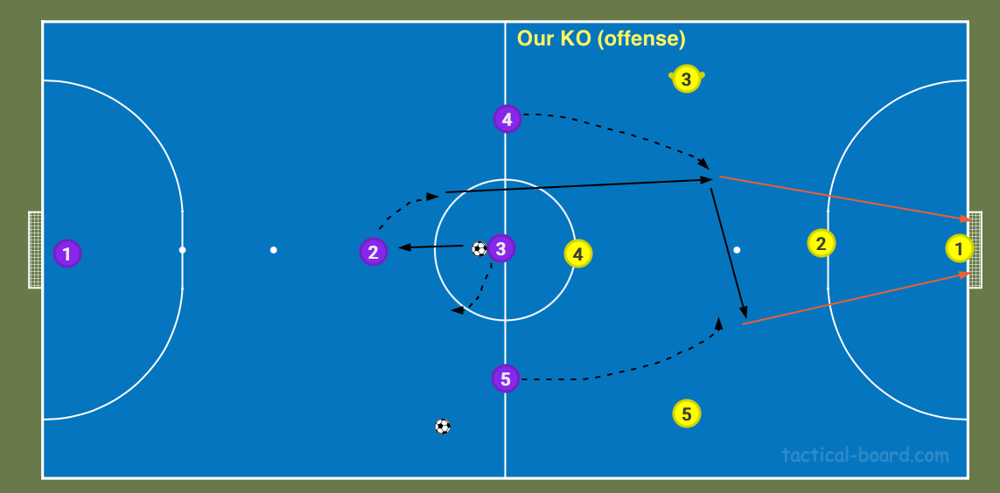

# Still No Pickles

* **OPERATION Still Not Winning**
    * General rules of thumb:
        * No mouthing off to the ref
            * Got a problem, get the captain to have a word
        * Turn up to games 15 mins before KO to WU and discuss tactics
        * Try to turn up Saturday mornings for drills and a kick about
        * Try to turn up to the SNP social (~1/season)
    * Captain:
        * Din
        * James (vice)
        * Reserve (GK)
    * Pens:
        1. Ollie
        2. Sam
        3. James
        4. Harry
    * Core Squad:
        * Din (1: DEF)
        * James (1: MID, 2: FOR)
        * Alex (1: DEF, 2: MID, 3: GK)
        * Ollie (1: FOR, 2: MID)
        * Mark (1: GK, 2: DEF)
        * Martin (1: GK, 2: DEF)
        * Harry (1: MID, 2: DEF)
        * Sam (1: FOR)
        * Glyn (1: DEF, 2: MID)
    * Formation: 2-1-1
        * GK (3)
        * DEF DEF (6)
        * MID (5)
        * FOR (3)
        
         
        
         
         

    * Tactics:
        * Attack FAST, Defend SLOW
        * 4 phases of play: dominate these and we'll win
            * Their GK (defense)

                

            * Their KO (defense)

                

            * Our GK (offense)

                
                 
                 
                

            * Our KO (offense)

                

        * GRoThumb - defending:
            * show them the corners (QPR drill)
            * don't press outside of our half
        * GRoThumb - attacking: 
            * don't shoot from half way
            * avoid the corners
    * Last thing: no reason we can't win the league